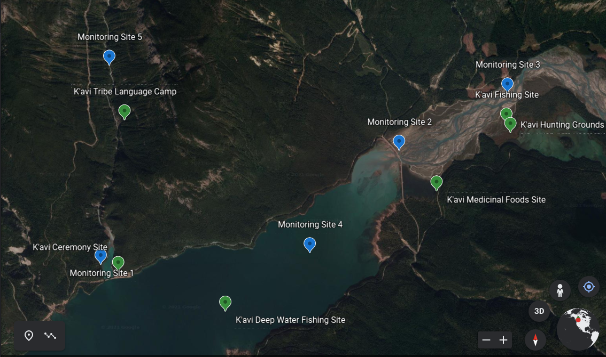

(mod_kav)=
# [Water Quality Modules](https://github.com/IndigenousEnvDataSci/WaterQuality_mod1)

The modules on this site are based on a fictional tribe called the K'avi. We needed the tribe to be fictional because we did not want to focus on any indigenous groups that I teach. The location is also fictional, but representative of a place with ample surface water, a high elevation stream network fed by glaciers with wetlands and a lake. Data is similar to data that has been collected in Western Montana, but for the purpose of these activities, we use 'dummy' data created for these modules. 

## Data science topics covered: 

## Module goals:

## Learning goals:

## Note for instructors: 

## Acknowledgements 

This activity was first created by Georgia Smies at Salish-Kootenai College, and developed by Helena S. Kleiner at University of Notre Dame. It was later modified by Cazimir Kowalski, also from University of Notre Dame. 